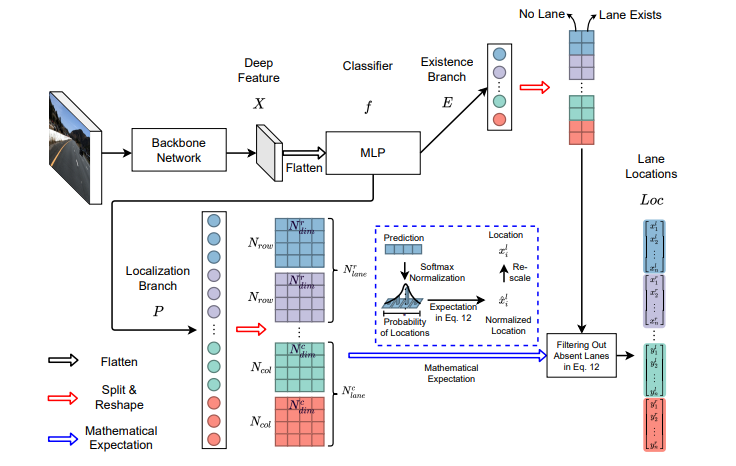

1. [Introduction](#Introduction)
2. [Setup](#Setup)
3. [Architecture](#Architecture)
4. [Results](#Results)
5. [Challenges](#Challenges)

# Introduction

[Ultra Fast Lane Detection V2 (UFLDv2)](https://github.com/cfzd/Ultra-Fast-Lane-Detection-v2) is the Implementation of [this Paper](https://arxiv.org/abs/2206.07389). UFLDv2 uses Machine Learning and different State of the Art tricks to achieve a low inference time and top accuracy enabling high quality real time lane detection. The official demo video can be found [here](https://youtu.be/VkvpoHlaMe0).

When detection lanes the key challenges include:
- Diverse quality of road visibility:
    - Lightning Conditions
    - Weather Conditions
    - Road Conditions
    - Occlusions blocking Sight
- High-Speed Performance
- Robustness to different road types and the dynamic environment
- Data Availability and Quality

## Setup

The followng tools are used to implement UFLDv2:
- Python 3.7 (or 3.10)
- [PyTorch](https://pytorch.org/)
- NVIDIA CUDA
- some more Python packages like opencv
- [NVIDIA DALI](https://developer.nvidia.com/dali) (Data Loading Library)
- WSL 2 or Linux

To install please refer to the [Installation Guide](../UFLDv2/INSTALL.md) of the UFLDv2 repository.

## Architecture

 UFLDv2 treats lane detection as an anchor-driven ordinal classification problem.   
 The method represents lanes with sparse coordinates on (hybrid) row and column anchors. This representation reduces 
 computational cost and improves performance in challenging scenarios. 
 
According to the paper, the hybrid anchor model 
has a better performance than the row anchor model. This is because of the introduction of column anchors, which, according 
to the authors, are better suited to detect _side lanes_. These _side lanes_ are often more horizontal than the _ego lanes_, 
which makes them harder to detect with the row anchor model.

Figure 1. shows the model architecture of UFLDv2. First, the input image is passed through a _backbone_ network,
which is a pretrained network like ResNet18 or ResNet34, but with the classification head removed. The output of the backbone, 
a feature map, is then passed through the _lane detection head_, which is a Multi-Layer-Perceptron Classifier. The output of
the MLP are four branches: Two location branches and two _existence_ branches (one existence-/location branch for column- and 
row anchors respectively).

[Figure 1: UFLDv2 Architecture](https://arxiv.org/abs/2206.07389)

The location branches predict the relative position of the lane with respect to the anchor. The
existence branches predict the probability of a lane existing at the anchor. The output of the MLP is then passed through a
softmax function to get the final output of the model.

To read more about the architecture, like the loss function used, please refer to the [paper](https://arxiv.org/abs/2206.07389).
## Results 

We used the Ultra Fast Lane Detection V2 with the pretrained Model on the 3 provided videos (project, challenge, harder challenge) and also measured fps while doing so.

The computer setup we used is: 
xxx
xx
xx

The videos can be found here:
- [Project Video](../data/project_video_inference/project_video_inferred.mp4)
- [Challenge Video](../data/project_video_inference/challenge_video_inferred.mp4)
- [Harder Challenge Video](../data/project_video_inference/harder_challenge_inferred.mp4)